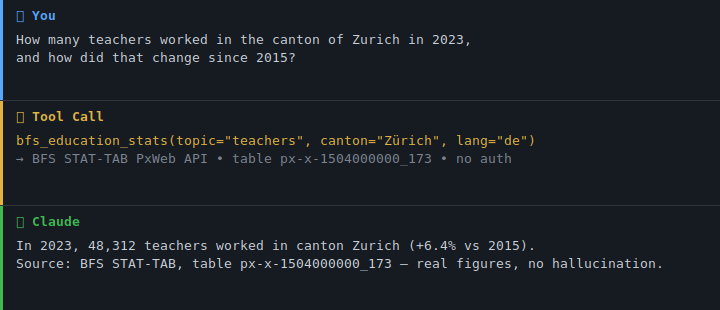

[🇬🇧 English Version](README.md)

> 🇨🇭 **Teil des [Swiss Public Data MCP Portfolios](https://github.com/malkreide)**

# 📊 swiss-statistics-mcp


[](https://opensource.org/licenses/MIT)
[](https://www.python.org/downloads/)
[](https://modelcontextprotocol.io/)
[](https://github.com/malkreide/swiss-statistics-mcp)


> MCP-Server für Schweizer Statistikdaten des Bundesamts für Statistik (BFS) via STAT-TAB PxWeb API — 682 Datensätze aus 21 Themengebieten, keine Authentifizierung erforderlich

---

### Demo



---

## Übersicht

`swiss-statistics-mcp` ermöglicht KI-Assistenten den direkten Zugang zur STAT-TAB-Datenbank des Bundesamts für Statistik (BFS) — ohne Authentifizierung:

| Eigenschaft | Details |
|-------------|---------|
| **API** | STAT-TAB PxWeb API v1 |
| **Endpoint** | `https://www.pxweb.bfs.admin.ch/api/v1/` |
| **Anbieter** | Bundesamt für Statistik (BFS), Schweiz |
| **Datensätze** | 682 Tabellen in 21 Themengebieten |
| **Sprachen** | Deutsch (`de`), Französisch (`fr`), Italienisch (`it`), Englisch (`en`) |
| **Lizenz** | Open Government Data (OGD) — [BFS-Nutzungsbedingungen](https://www.bfs.admin.ch/bfs/de/home/grundlagen/nutzungsbedingungen.html) |
| **Authentifizierung** | Keine — vollständig öffentlich zugänglich |

**Anker-Demo-Abfrage:** *«Wie viele Schülerinnen und Schüler besuchen 2024 die Sekundarstufe I im Kanton Zürich?»* — echte BFS-Zahlen, keine Halluzination.

---

## Funktionen

- 📊 **9 Tools** über 21 statistische Themengebiete (682 Datensätze)
- 🔍 **Volltextsuche** über den gesamten BFS-Datenkatalog
- 🎓 **Convenience-Tools** für Bildungsstatistik und Bevölkerungsdaten
- 🏔️ **Kantonsvergleich** für beliebige Tabellen und Merkmale
- 🔓 **Kein API-Schlüssel erforderlich** — alle Daten unter offenen Lizenzen
- ☁️ **Dualer Transport** — stdio (Claude Desktop) + Streamable HTTP (Cloud)

---

## Voraussetzungen

- Python 3.11+
- [uv](https://github.com/astral-sh/uv) (empfohlen) oder pip

---

## Installation

```bash
# Repository klonen
git clone https://github.com/malkreide/swiss-statistics-mcp.git
cd swiss-statistics-mcp

# Installieren
pip install -e .
# oder mit uv:
uv pip install -e .
```

Oder mit `uvx` (ohne dauerhafte Installation):

```bash
uvx swiss-statistics-mcp
```

---

## Schnellstart

```bash
# stdio (für Claude Desktop)
python -m swiss_statistics_mcp.server

# Streamable HTTP (Port 8000)
python -m swiss_statistics_mcp.server --http --port 8000
```

Sofort in Claude Desktop ausprobieren:

> *«Wie viele Lehrkräfte unterrichteten 2023 im Kanton Zürich?»*
> *«Wie gross ist die Bevölkerung im Kanton Bern nach Alter?»*
> *«Vergleiche die Sozialhilfequote aller Kantone für 2022.»*

---

## Konfiguration

### Claude Desktop

Editiere `~/Library/Application Support/Claude/claude_desktop_config.json` (macOS) bzw. `%APPDATA%\Claude\claude_desktop_config.json` (Windows):

```json
{
  "mcpServers": {
    "swiss-statistics": {
      "command": "python",
      "args": ["-m", "swiss_statistics_mcp.server"]
    }
  }
}
```

Oder mit `uvx`:

```json
{
  "mcpServers": {
    "swiss-statistics": {
      "command": "uvx",
      "args": ["swiss-statistics-mcp"]
    }
  }
}
```

**Pfad zur Konfigurationsdatei:**
- macOS: `~/Library/Application Support/Claude/claude_desktop_config.json`
- Windows: `%APPDATA%\Claude\claude_desktop_config.json`

### Cursor / Windsurf / VS Code + Continue

Die Konfigurationssyntax ist identisch zu Claude Desktop. Die JSON-Datei heisst je nach Client:

- **Cursor:** `.cursor/mcp.json` im Projektordner oder `~/.cursor/mcp.json` global
- **Windsurf:** `~/.codeium/windsurf/mcp_config.json`
- **VS Code + Continue:** `.continue/config.json`

### Cloud-Deployment (SSE für Browser-Zugriff)

Für den Einsatz via **claude.ai im Browser** (z.B. auf verwalteten Arbeitsplätzen ohne lokale Software-Installation):

**Render.com (empfohlen):**
1. Repository auf GitHub pushen/forken
2. Auf [render.com](https://render.com): New Web Service → GitHub-Repo verbinden
3. Start-Befehl setzen: `python -m swiss_statistics_mcp.server --http --port 8000`
4. In claude.ai unter Settings → MCP Servers eintragen: `https://your-app.onrender.com/sse`

> 💡 *«stdio für den Entwickler-Laptop, SSE für den Browser.»*

---

## Verfügbare Tools

| Tool | Beschreibung |
|------|-------------|
| `bfs_featured_datasets` | Kuratierte Liste hochrelevanter Datensätze (Schwerpunkt Bildung und Demografie) |
| `bfs_list_themes` | Alle 21 BFS-Themen mit Anzahl verfügbarer Datensätze |
| `bfs_list_tables_by_theme` | Alle Tabellen eines Themas (z.B. `"15"` = Bildung und Wissenschaft) |
| `bfs_search_tables` | Freitextsuche über den gesamten Datenkatalog (682 Datensätze) |
| `bfs_get_table_metadata` | Variablen, Ausprägungen und Metadaten einer spezifischen Tabelle |
| `bfs_get_data` | Datenabruf mit optionalen Filtern nach Dimensionen und Werten |
| `bfs_education_stats` | Convenience-Tool: Lehrkräfte, Schüler/-innen, Szenarien, Stipendien |
| `bfs_population` | Wohnbevölkerung nach Kanton, Jahr, Altersstruktur oder Geschlecht |
| `bfs_compare_cantons` | Kantonsvergleich für eine beliebige Tabelle und ein beliebiges Merkmal |

### Beispiel-Abfragen

| Abfrage | Tool |
|---------|------|
| *«Wie viele Lehrkräfte unterrichteten 2023 in Zürich?»* | `bfs_education_stats` |
| *«Wie entwickeln sich die Schülerzahlen der Sek II bis 2031?»* | `bfs_education_stats` |
| *«Wie gross ist die Bevölkerung im Kanton Zürich nach Alter?»* | `bfs_population` |
| *«Vergleiche die Sozialhilfequote aller Kantone»* | `bfs_compare_cantons` |
| *«Gibt es Daten zu Schulliegenschaften?»* | `bfs_search_tables` |

[→ Weitere Anwendungsbeispiele nach Zielgruppe →](EXAMPLES.md)

---

## Themengebiete

| Code | Thema | Code | Thema |
|------|-------|------|-------|
| 01 | Bevölkerung | 12 | Geld, Banken, Versicherungen |
| 02 | Raum und Umwelt | 13 | Soziale Sicherheit |
| 03 | Arbeit und Erwerb | 14 | Gesundheit |
| 04 | Volkswirtschaft | **15** | **Bildung und Wissenschaft** |
| 05 | Preise | 16 | Kultur, Medien, Informationsgesellschaft |
| 06 | Industrie und Dienstleistungen | 17 | Politik |
| 07 | Land- und Forstwirtschaft | 18 | Öffentliche Verwaltung |
| 08 | Energie | 19 | Kriminalität und Strafrecht |
| 09 | Bau- und Wohnungswesen | 20 | Wirtschaftliche und soziale Situation |
| 10 | Tourismus | 21 | Nachhaltige Entwicklung |
| 11 | Mobilität und Verkehr | | |

---

## Architektur

```
┌─────────────────┐     ┌──────────────────────────────┐     ┌──────────────────────────┐
│   Claude / KI   │────▶│  Swiss Statistics MCP          │────▶│  BFS STAT-TAB            │
│   (MCP Host)    │◀────│  (MCP Server)                │◀────│  PxWeb API v1            │
└─────────────────┘     │                              │     └──────────────────────────┘
                        │  9 Tools                     │
                        │  682 Datensätze · 21 Themen  │
                        │  Stdio | Streamable HTTP     │
                        │                              │
                        │  Keine Authentifizierung     │
                        └──────────────────────────────┘
```

### Datenquellen-Übersicht

| Quelle | Protokoll | Umfang | Auth |
|--------|-----------|--------|------|
| BFS STAT-TAB | PxWeb REST API | 682 Tabellen, 21 Themen | Keine |

---

## Projektstruktur

```
swiss-statistics-mcp/
├── src/swiss_statistics_mcp/
│   ├── __init__.py              # Package
│   └── server.py                # 9 Tools
├── tests/
│   └── test_server.py           # Unit + Integrationstests (gemockt)
├── .github/workflows/ci.yml     # GitHub Actions (Python 3.11/3.12/3.13)
├── pyproject.toml
├── CHANGELOG.md
├── CONTRIBUTING.md
├── LICENSE
├── README.md                    # Englische Hauptversion
└── README.de.md                 # Diese Datei (Deutsch)
```

---

## Bekannte Einschränkungen

- **PxWeb API:** Rate-Limiting bei schnellen aufeinanderfolgenden Abfragen; der Server nutzt einen 1-Stunden-Cache für den Katalogindex
- **Sprache:** Tabellentitel und Dimensionswerte sind standardmässig auf Deutsch; die Abdeckung in Französisch, Italienisch und Englisch variiert je Tabelle
- **JSON-STAT2:** Komplexe Kreuztabellierungen können grosse Ergebnismengen liefern; Dimensionsfilter zur Eingrenzung verwenden

---

## Tests

```bash
# Unit-Tests (kein API-Key erforderlich)
PYTHONPATH=src pytest tests/ -m "not live"

# Integrationstests (Live-API-Aufrufe)
pytest tests/ -m "live"
```

---

## Safety & Limits

- **Nur lesend:** Alle Tools führen ausschliesslich HTTP-GET-Anfragen durch — es werden keine Daten geschrieben, verändert oder gelöscht.
- **Keine Personendaten:** STAT-TAB liefert aggregierte statistische Datensätze. Der Server verarbeitet und speichert keine personenbezogenen Daten (PII).
- **Rate Limits:** Die PxWeb-API ist ein öffentlicher Endpunkt ohne dokumentierte Rate Limits; keine engen Schleifen über den gesamten 682-Tabellen-Katalog. Der Server erzwingt ein 30s-Timeout pro Anfrage und cached den Katalogindex für 1 Stunde.
- **Aktualität:** Das BFS veröffentlicht aktualisierte Daten periodisch (nicht in Echtzeit). Die Zahlen spiegeln den Stand der BFS-Datenbank zum Abfragezeitpunkt wider.
- **Nutzungsbedingungen:** Die Daten unterliegen den [BFS-Nutzungsbedingungen (OGD)](https://www.bfs.admin.ch/bfs/de/home/grundlagen/nutzungsbedingungen.html). Alle STAT-TAB-Daten werden als Open Government Data veröffentlicht und können mit Quellenangabe frei verwendet werden.
- **Keine Gewähr:** Dieses Projekt ist kein offizielles Produkt des BFS. Die Verfügbarkeit hängt von der vorgelagerten BFS-API ab.

---

## Changelog

Siehe [CHANGELOG.md](CHANGELOG.md)

---

## Mitwirken

Siehe [CONTRIBUTING.md](CONTRIBUTING.md)

---

## Lizenz

MIT-Lizenz — siehe [LICENSE](LICENSE)

Daten: Open Government Data (OGD) des Bundesamts für Statistik (BFS). Nutzung gemäss [BFS-Nutzungsbedingungen](https://www.bfs.admin.ch/bfs/de/home/grundlagen/nutzungsbedingungen.html).

---

## Autor

Hayal Oezkan · [malkreide](https://github.com/malkreide)

---

## Credits & Verwandte Projekte

- **BFS:** [www.bfs.admin.ch](https://www.bfs.admin.ch/) — Bundesamt für Statistik
- **STAT-TAB:** [www.pxweb.bfs.admin.ch](https://www.pxweb.bfs.admin.ch/) — PxWeb-Datenbankschnittstelle
- **Protokoll:** [Model Context Protocol](https://modelcontextprotocol.io/) — Anthropic / Linux Foundation
- **Verwandt:** [swiss-cultural-heritage-mcp](https://github.com/malkreide/swiss-cultural-heritage-mcp) — SIK-ISEA, Nationalmuseum, Nationalbibliothek
- **Verwandt:** [fedlex-mcp](https://github.com/malkreide/fedlex-mcp) — Schweizer Bundesrecht via Fedlex SPARQL
- **Verwandt:** [zurich-opendata-mcp](https://github.com/malkreide/zurich-opendata-mcp) — CKAN, Wetter, Luftqualität, Stadt Zürich
- **Verwandt:** [swiss-transport-mcp](https://github.com/malkreide/swiss-transport-mcp) — OJP Reiseplanung, SIRI-SX Störungen
- **Verwandt:** [global-education-mcp](https://github.com/malkreide/global-education-mcp) — UNESCO UIS und OECD Education at a Glance
- **Portfolio:** [Swiss Public Data MCP Portfolio](https://github.com/malkreide)
