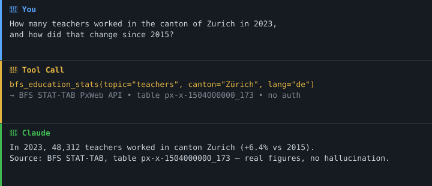

[🇬🇧 English Version](README.md)

> 🇨🇭 **Teil des [Swiss Public Data MCP Portfolios](https://github.com/malkreide)**

# 📊 swiss-statistics-mcp


[](https://opensource.org/licenses/MIT)
[](https://www.python.org/downloads/)
[](https://modelcontextprotocol.io/)
[](https://github.com/malkreide/swiss-statistics-mcp)


> MCP-Server für Schweizer Statistikdaten des Bundesamts für Statistik (BFS) via STAT-TAB PxWeb API — 682 Datensätze aus 21 Themengebieten, keine Authentifizierung erforderlich

---

### Demo



---

## Reifegrad

Dieser Server befindet sich im **Alpha-Stadium (0.x)** gemäss [PyPI-Classifier](https://pypi.org/classifiers/). Bis zur Version 1.0:

- Tool-Namen, Input-Schemas und Output-JSON-Keys KÖNNEN sich zwischen Minor-Versionen ändern
- Cloud-Deployments auf einen spezifischen Git-Tag pinnen, nicht auf `main`
- Produktiv-Einsatz für Read-Only-Open-Data-Szenarien akzeptabel; für User-facing-Use-Cases als experimentell behandeln

Breaking Changes siehe [CHANGELOG.md](./CHANGELOG.md).

---

## Übersicht

`swiss-statistics-mcp` ermöglicht KI-Assistenten den direkten Zugang zur STAT-TAB-Datenbank des Bundesamts für Statistik (BFS) — ohne Authentifizierung:

| Eigenschaft | Details |
|-------------|---------|
| **API** | STAT-TAB PxWeb API v1 |
| **Endpoint** | `https://www.pxweb.bfs.admin.ch/api/v1/` |
| **Anbieter** | Bundesamt für Statistik (BFS), Schweiz |
| **Datensätze** | 682 Tabellen in 21 Themengebieten |
| **Sprachen** | Deutsch (`de`), Französisch (`fr`), Italienisch (`it`), Englisch (`en`) |
| **Lizenz** | Open Government Data (OGD) — [BFS-Nutzungsbedingungen](https://www.bfs.admin.ch/bfs/de/home/grundlagen/nutzungsbedingungen.html) |
| **Authentifizierung** | Keine — vollständig öffentlich zugänglich |

**Anker-Demo-Abfrage:** *«Wie viele Schülerinnen und Schüler besuchen 2024 die Sekundarstufe I im Kanton Zürich?»* — echte BFS-Zahlen, keine Halluzination.

---

## Funktionen

- 📊 **15 Tools**: 8 über 21 statistische Themengebiete (682 Datensätze) + eine 4-Tool-Referenzschicht (Gemeinden & Historik) + 2 Tools für Bau- und Immobilienstatistik + ein Preisindex-Tool
- 🔍 **Volltextsuche** über den gesamten BFS-Datenkatalog
- 🎓 **Convenience-Tools** für Bildungsstatistik und Bevölkerungsdaten
- 🏗️ **Baustatistik** — neu erstellte Gebäude/Wohnungen und Bauinvestitionen inkl. Arbeitsvorrat als Frühindikator
- 🏠 **Preisindizes** — Baupreisindex (geparste Reihe) und Wohnimmobilienpreisindex (IMPI) über die BFS-DAM-/CKAN-Quellen
- 🏔️ **Kantonsvergleich** für beliebige Tabellen und Merkmale
- 🔓 **Kein API-Schlüssel erforderlich** — alle Daten unter offenen Lizenzen
- ☁️ **Dualer Transport** — stdio (Claude Desktop) + Streamable HTTP (Cloud)

---

## Voraussetzungen

- Python 3.11+
- [uv](https://github.com/astral-sh/uv) (empfohlen) oder pip

---

## Installation

```bash
# Repository klonen
git clone https://github.com/malkreide/swiss-statistics-mcp.git
cd swiss-statistics-mcp

# Installieren
pip install -e .
# oder mit uv:
uv pip install -e .
```

Oder mit `uvx` (ohne dauerhafte Installation):

```bash
uvx swiss-statistics-mcp
```

---

## Schnellstart

```bash
# stdio (für Claude Desktop)
python -m swiss_statistics_mcp.server

# Streamable HTTP, nur Loopback (Default: host=127.0.0.1, port=8000)
python -m swiss_statistics_mcp.server --http --port 8000

# Streamable HTTP, alle Interfaces (nur hinter Reverse-Proxy mit Access Control)
MCP_HOST=0.0.0.0 python -m swiss_statistics_mcp.server --http --port 8000
# oder
python -m swiss_statistics_mcp.server --http --host 0.0.0.0 --port 8000
```

Sofort in Claude Desktop ausprobieren:

> *«Wie viele Lehrkräfte unterrichteten 2023 im Kanton Zürich?»*
> *«Wie gross ist die Bevölkerung im Kanton Bern nach Alter?»*
> *«Vergleiche die Sozialhilfequote aller Kantone für 2022.»*

---

## Konfiguration

### Claude Desktop

Editiere `~/Library/Application Support/Claude/claude_desktop_config.json` (macOS) bzw. `%APPDATA%\Claude\claude_desktop_config.json` (Windows):

```json
{
  "mcpServers": {
    "swiss-statistics": {
      "command": "python",
      "args": ["-m", "swiss_statistics_mcp.server"]
    }
  }
}
```

Oder mit `uvx`:

```json
{
  "mcpServers": {
    "swiss-statistics": {
      "command": "uvx",
      "args": ["swiss-statistics-mcp"]
    }
  }
}
```

**Pfad zur Konfigurationsdatei:**
- macOS: `~/Library/Application Support/Claude/claude_desktop_config.json`
- Windows: `%APPDATA%\Claude\claude_desktop_config.json`

### Cursor / Windsurf / VS Code + Continue

Die Konfigurationssyntax ist identisch zu Claude Desktop. Die JSON-Datei heisst je nach Client:

- **Cursor:** `.cursor/mcp.json` im Projektordner oder `~/.cursor/mcp.json` global
- **Windsurf:** `~/.codeium/windsurf/mcp_config.json`
- **VS Code + Continue:** `.continue/config.json`

### Cloud-Deployment (SSE für Browser-Zugriff)

Für den Einsatz via **claude.ai im Browser** (z.B. auf verwalteten Arbeitsplätzen ohne lokale Software-Installation).

> ⚠️ **Security-Hinweis — dieser Server hat keine Authentifizierung.** Eine
> öffentliche URL macht ihn zum Open Proxy zur BFS-API auf der IP deines
> Deployments. Jeder Client mit der URL kann die Tools nutzen, dein
> Platform-Kontingent verbrauchen und Traffic auf deine IP attribuieren.
> Zwei Mitigationen, in absteigender Präferenz:
>
> 1. **Hinter Access Control stellen** — Render «Private Service»,
>    Cloudflare Access oder Reverse-Proxy mit Basic-Auth / IP-Allowlist
>    vor dem Container.
> 2. **Bewusst als öffentlicher Open-Data-Proxy akzeptieren** — nur
>    vertretbar, weil alle Daten BFS OGD (Public Open Data) sind und die
>    Tools read-only.
>
> Der Server bindet per Default auf `127.0.0.1`. Für Container-Port-Exposure
> musst du explizit `MCP_HOST=0.0.0.0` setzen (z.B. als Render-Env-Var) oder
> `--host 0.0.0.0` übergeben. Nicht ohne eine der Mitigationen oben.

**Render.com:**
1. Repository auf GitHub pushen/forken
2. Auf [render.com](https://render.com): New Web Service → GitHub-Repo verbinden
3. Environment-Variable setzen: `MCP_HOST=0.0.0.0`
4. Start-Befehl setzen: `python -m swiss_statistics_mcp.server --http --port 8000`
5. In claude.ai unter Settings → MCP Servers eintragen: `https://your-app.onrender.com/sse`

> 💡 *«stdio für den Entwickler-Laptop, SSE für den Browser.»*

---

## Output-Schema

Seit `v0.2.0` liefert jedes Tool ein typisiertes Pydantic-Model statt eines
JSON-Strings. FastMCP serialisiert das als strukturierten Content, sodass
MCP-Clients die Felder direkt lesen können.

```python
# Alt (vor 0.2.0)
result = await bfs_get_data(...)        # str
data = json.loads(result)               # dict
print(data["rows_total"])

# Neu (>= 0.2.0)
result = await bfs_get_data(...)        # DataTableResult
print(result.rows_total)                # 1000
print(result.truncated)                 # True
```

Jedes Result hat top-level `error: str | None` und `hint: str | None` —
`result.error is None` bedeutet Erfolg. Daten-Tools (`bfs_get_data`,
`bfs_education_stats`, `bfs_population`, `bfs_compare_cantons`) liefern
zusätzlich `truncated: bool`, `rows_total: int`, `rows_returned: int`
für maschinen-lesbare Trunkierungs-Erkennung.

| Tool | Result-Type |
|------|-------------|
| `bfs_browse_catalog` | `BrowseCatalogResult` |
| `bfs_search_tables` | `SearchTablesResult` |
| `bfs_get_table_metadata` | `TableMetadataResult` |
| `bfs_get_data` | `DataTableResult` |
| `bfs_education_stats` | `DataTableResult` |
| `bfs_population` | `DataTableResult` |
| `bfs_compare_cantons` | `DataTableResult` |
| `bfs_featured_datasets` | `FeaturedDatasetsResult` |
| `lookup_commune` | `LookupCommuneResult` |
| `resolve_historical_commune` | `ResolveHistoricalCommuneResult` |
| `list_communes` | `ListCommunesResult` |
| `search_historical_series` | `SearchHistoricalSeriesResult` |
| `bfs_construction_activity` | `ConstructionActivityResult` |
| `bfs_construction_investment` | `ConstructionInvestmentResult` |
| `bfs_price_index` | `PriceIndexResult` |

Die Ergebnisse der Referenzschicht führen zusätzlich `source` (Quellenangabe) und `provenance` (`live_api` \| `cached`); `SearchHistoricalSeriesResult` trägt zudem `licence_note` mit dem obligatorischen HSSO-NonCommercial-Hinweis. Die Bau- und Preisindex-Ergebnisse tragen `source` + `provenance` nach demselben Envelope-Muster.

---

## Verfügbare Tools

| Tool | Beschreibung |
|------|-------------|
| `bfs_featured_datasets` | Kuratierte Liste hochrelevanter Datensätze (Schwerpunkt Bildung und Demografie) |
| `bfs_browse_catalog` | Katalog durchsuchen: alle 21 Themen (ohne `theme_code`) oder alle Tabellen eines Themas (z.B. `theme_code="15"` = Bildung und Wissenschaft) |
| `bfs_search_tables` | Freitextsuche über den gesamten Datenkatalog (682 Datensätze) |
| `bfs_get_table_metadata` | Variablen, Ausprägungen und Metadaten einer spezifischen Tabelle |
| `bfs_get_data` | Datenabruf mit optionalen Filtern nach Dimensionen und Werten |
| `bfs_education_stats` | Convenience-Tool: Lehrkräfte, Schüler/-innen, Szenarien, Stipendien |
| `bfs_population` | Wohnbevölkerung nach Kanton, Jahr, Altersstruktur oder Geschlecht |
| `bfs_compare_cantons` | Kantonsvergleich für eine beliebige Tabelle und ein beliebiges Merkmal |
| `lookup_commune` | Gemeinde nach Name oder BFS-Nummer zu einem Stichtag auflösen (Kanton, Gültigkeit, LINDAS-URI) |
| `resolve_historical_commune` | Historische BFS-Nummer auf heutige Nummer(n) abbilden — alte Statistiken über Fusionen umschlüsseln |
| `list_communes` | Alle Gemeinden eines Kantons zu einem Stichtag auflisten |
| `search_historical_series` | Langzeit-Zeitreihen der Historischen Statistik der Schweiz (HSSO) durchsuchen |
| `bfs_construction_activity` | Neu erstellte Gebäude & Wohnungen pro Gemeinde (jährlich), inkl. Zimmerzahl-Verteilung |
| `bfs_construction_investment` | Bauinvestitionen & Arbeitsvorrat (Frühindikator) nach Grossregion/Kanton/Gemeinde |
| `bfs_price_index` | Baupreisindex (geparste Reihe) / Wohnimmobilienpreisindex (IMPI, Quellenlinks) |

Vier dieser Tools bilden die **Referenzschicht** des Portfolios (siehe [Join Keys](#join-keys)): Sie machen amtliche BFS-Gemeindenummern zum verlässlichen Join-Key und ermöglichen die Umschlüsselung von Statistiken über Gemeindefusionen hinweg. Die beiden `bfs_construction_*`-Tools decken STAT-TAB-Thema 09 (Bau- und Wohnungswesen) ab — siehe [Bau-Quellen](#bau-quellen). `bfs_price_index` deckt Preisindizes ab, die **nicht** in STAT-TAB liegen — siehe [Preisindex-Quellen](#preisindex-quellen).

### Bau-Quellen

| Cube-ID | Titel | Abdeckung | Genutzt von |
|---------|-------|-----------|-------------|
| `px-x-0904030000_106` | Neu erstellte Gebäude mit Wohnungen nach Gemeinde, Gebäudetyp | 2013– | `bfs_construction_activity` |
| `px-x-0904030000_105` | Neu erstellte Wohnungen nach Gemeinde, Anzahl Zimmer | 2013– | `bfs_construction_activity` |
| `px-x-0904010000_205` | Bauinvestitionen und Arbeitsvorrat nach Grossregion/Kanton/Gemeinde | 1994– | `bfs_construction_investment` |

> Die Gemeinde-Baustatistik vor 2013 liegt in den eingestellten Cubes `px-x-0904030000_101`/`_104` (1995–2012), die eine andere Geo-Kodierung nutzen und von diesen Tools nicht abgefragt werden. Gebäude-/Wohnungszahlen sind die **konsolidierte amtliche Jahresstatistik** — für tagesaktuelle Registerstände und die Bau-Pipeline gegen `swiss-housing-mcp` cross-validieren (bewusste Redundanz).

### Preisindex-Quellen

`bfs_price_index` deckt zwei Indizes ab, die **nicht** über STAT-TAB publiziert werden. Ihre Datasets liegen auf [opendata.swiss](https://opendata.swiss) (CKAN); die Datendateien selbst sind [BFS-DAM-Assets](https://dam-api.bfs.admin.ch).

| Index | Quelle | Rückgabe |
|-------|--------|----------|
| `baupreisindex` | opendata.swiss-Dataset *Schweizerischer Baupreisindex (Multibasen)* → DAM-**XLSX**-Asset | Geparste nationale Halbjahresreihe (Schweiz, Baugewerbe Total), inkl. Basisperiode |
| `impi` | opendata.swiss-Dataset *Schweizerischer Wohnimmobilienpreisindex (IMPI)* → DAM-**PDF/HTML**-Assets | Nur Quellenlinks — das BFS publiziert keine maschinenlesbare IMPI-Reihe |

> Zwei Eigenheiten werden für dich behandelt: `ckan.opendata.swiss` liefert Default-User-Agents ein **HTTP 403**, daher sendet jeder Aufruf einen eigenen `swiss-statistics-mcp/<Version>`-User-Agent; und DAM-Assets **mischen Formate**, daher wird die XLSX über die Prüfung des `content-type` selektiert (PDFs werden übersprungen). Ergebnisse werden 24 h gecacht.

### Beispiel-Abfragen

| Abfrage | Tool |
|---------|------|
| *«Wie viele Lehrkräfte unterrichteten 2023 in Zürich?»* | `bfs_education_stats` |
| *«Wie entwickeln sich die Schülerzahlen der Sek II bis 2031?»* | `bfs_education_stats` |
| *«Wie gross ist die Bevölkerung im Kanton Zürich nach Alter?»* | `bfs_population` |
| *«Vergleiche die Sozialhilfequote aller Kantone»* | `bfs_compare_cantons` |
| *«Gibt es Daten zu Schulliegenschaften?»* | `bfs_search_tables` |
| *«Welche Zürcher Gemeinden sind seit 2000 fusioniert, und auf welche heutigen BFS-Nummern muss ich alte Statistiken umschlüsseln?»* | `resolve_historical_commune` |
| *«Liste alle Gemeinden des Kantons Glarus heute auf»* | `list_communes` |
| *«Finde Langzeitreihen zur Bevölkerung in der HSSO»* | `search_historical_series` |
| *«Wie viele Wohnungen wurden seit 2018 in Winterthur neu erstellt, nach Zimmerzahl?»* | `bfs_construction_activity` |
| *«Wie hoch sind Bauinvestitionen und Arbeitsvorrat im Kanton Zürich?»* | `bfs_construction_investment` |
| *«Wie hat sich der Baupreisindex seit 2015 entwickelt?»* | `bfs_price_index` |

[→ Weitere Anwendungsbeispiele nach Zielgruppe →](EXAMPLES.md)

---

## Themengebiete

| Code | Thema | Code | Thema |
|------|-------|------|-------|
| 01 | Bevölkerung | 12 | Geld, Banken, Versicherungen |
| 02 | Raum und Umwelt | 13 | Soziale Sicherheit |
| 03 | Arbeit und Erwerb | 14 | Gesundheit |
| 04 | Volkswirtschaft | **15** | **Bildung und Wissenschaft** |
| 05 | Preise | 16 | Kultur, Medien, Informationsgesellschaft |
| 06 | Industrie und Dienstleistungen | 17 | Politik |
| 07 | Land- und Forstwirtschaft | 18 | Öffentliche Verwaltung |
| 08 | Energie | 19 | Kriminalität und Strafrecht |
| 09 | Bau- und Wohnungswesen | 20 | Wirtschaftliche und soziale Situation |
| 10 | Tourismus | 21 | Nachhaltige Entwicklung |
| 11 | Mobilität und Verkehr | | |

---

## Architektur

```
┌─────────────────┐     ┌──────────────────────────────┐     ┌──────────────────────────┐
│   Claude / KI   │────▶│  Swiss Statistics MCP          │────▶│  BFS STAT-TAB            │
│   (MCP Host)    │◀────│  (MCP Server)                │◀────│  PxWeb API v1            │
└─────────────────┘     │                              │     └──────────────────────────┘
                        │  15 Tools                    │
                        │  + Gemeinde-/Historik-Ref    │
                        │  + Baustatistik (Thema 09)   │
                        │  + Preisindizes (DAM/CKAN)   │
                        │  Stdio | Streamable HTTP     │
                        │                              │
                        │  Keine Authentifizierung     │
                        └──────────────────────────────┘
```

### Datenquellen-Übersicht

| Quelle | Protokoll | Umfang | Auth | Lizenz |
|--------|-----------|--------|------|--------|
| BFS STAT-TAB | PxWeb REST API | 682 Tabellen, 21 Themen | Keine | OGD |
| BFS AGVCH (Gemeindeverzeichnis) | REST (CSV/XLSX) | Snapshots, Mutationen, Übereinstimmungen | Keine | OGD |
| HSSO (Historische Statistik) | Statische XLSX-Dumps | ~750 Langzeittabellen | Keine | CC BY-NC-SA 3.0 |
| BFS DAM + opendata.swiss (CKAN) | CKAN-Metadaten + DAM XLSX/PDF | Baupreisindex, IMPI | Keine (eigener UA nötig) | OGD |

### Architektur-Entscheid

- **AGVCH-Gemeindeverzeichnis → Architektur A (Live-API-only).** Der [offizielle REST-Dienst](https://www.agvchapp.bfs.admin.ch/de/home) (`snapshot` / `correspondances` / `mutations` / `levels`) ist eine saubere, versionierte, No-Auth-API — live geprüft am 19.07.2026 — daher fragen die Gemeinde-Tools sie direkt mit einem 24-h-Cache und der gemeinsamen Retry-Policy ab. Kein Dump-Fallback nötig. **Fund:** Der Live-Snapshot-CSV-Header nutzt `Inscription,Radiation,Rec_Type_fr` (nicht die im API-PDF gedruckten `Einschreibung,Streichung`), und `HistoricalCode` ist **nicht** ebenenübergreifend eindeutig — der `Parent`-Link wird beim Herleiten des Kantons pro Ebene aufgelöst.
- **HSSO → Architektur C (Dump-only).** HSSO bietet keine API, nur statische XLSX pro Tabelle unter stabilen URLs (`/get/{KAPITEL}.{NN}{Suffix}.xlsx`). `search_historical_series` baut einen gecachten Titel-Index aus den Kapitelseiten und liefert die stabile Download-URL. HSSO steht unter **CC BY-NC-SA 3.0 (NonCommercial)** — abweichend von der OGD-Baseline dieses Servers — daher trägt jede HSSO-Antwort einen expliziten NonCommercial-Hinweis in `licence_note`.

---

## Join Keys

Die Referenzschicht existiert, damit Daten verschiedener Server des [Swiss Public Data MCP Portfolios](https://github.com/malkreide) verlässlich verknüpft werden können. Drei Identifikatoren sind die portfolioweiten Schlüssel:

| Schlüssel | Identifiziert | Kanonische Form | Hinweise |
|-----------|---------------|-----------------|----------|
| **BFS-Gemeindenummer** (`BfsCode`) | Eine politische Gemeinde | Ganzzahl, z.B. `261` (Zürich) | Primärer Join-Key über Statistik-, Geo-, Bildungs- und Gesundheitsdaten. Stabile LINDAS-URI: `https://ld.admin.ch/municipality/{BfsCode}`. **Zeitlich nicht stabil** — eine Fusion vergibt eine neue Nummer, historische Daten müssen via `resolve_historical_commune` umgeschlüsselt werden. |
| **EGID** | Ein einzelnes Gebäude (Eidg. Gebäudeidentifikator) | 9-stellige Ganzzahl | Join-Key für gebäude-/wohnungsbezogene Daten (GWR, Energie, Adressen). Eine Gemeinde enthält viele EGIDs; `BfsCode` ist die Gemeinde, in der ein EGID liegt. |
| **Kantonskürzel** | Einen Kanton | zwei Buchstaben, z.B. `ZH` | Gröbster geografischer Schlüssel. Aus jeder Gemeinde über die `Parent`-Kette herleitbar (als `canton_abbr` ausgegeben). |

**Warum Umschlüsselung wichtig ist.** BFS-Gemeindenummern ändern sich bei Fusionen, Aufteilungen oder Kantonswechseln. Vor einer Fusion publizierte Statistiken nutzen die alte Nummer; eine Verknüpfung mit heutigen Daten ohne Umschlüsselung lässt Zeilen still fallen oder ordnet sie falsch zu. `resolve_historical_commune(bfs_number, from_date, to_date)` liefert die `resolves_to`-Menge — die heutige(n) Nummer(n), auf die alte Werte aggregiert werden müssen — plus den `mutation_path` (Fusionen/Umbenennungen mit Daten). Andere Portfolio-Server sollen diesen Vertrag konzeptionell spiegeln, damit derselbe Schlüssel überall gleich aufgelöst wird.

**Beispiel (Anchor-Query).** *«Welche Zürcher Gemeinden sind seit 2000 fusioniert?»* — z.B. alt `132 Hirzel` und `133 Horgen` schlüsseln beide auf heute `295 Horgen` um; `134/140/142` auf `293 Wädenswil`.

---

## Projektstruktur

```
swiss-statistics-mcp/
├── src/swiss_statistics_mcp/
│   ├── __init__.py              # Package
│   └── server.py                # 15 Tools
├── tests/
│   └── test_server.py           # Unit + Integrationstests (gemockt)
├── .github/workflows/ci.yml     # GitHub Actions (Python 3.11/3.12/3.13)
├── pyproject.toml
├── CHANGELOG.md
├── CONTRIBUTING.md              # Englisch
├── CONTRIBUTING.de.md           # Deutsche Version
├── SECURITY.md                  # Englisch
├── SECURITY.de.md               # Deutsche Version
├── LICENSE
├── README.md                    # Englische Hauptversion
└── README.de.md                 # Diese Datei (Deutsch)
```

---

## Observability

Der Server schreibt pro Tool-Call **eine JSON-Log-Zeile** auf stderr:

```jsonc
{"ts": "2026-05-20T04:02:28", "level": "INFO", "logger": "swiss_statistics_mcp",
 "event": "tool_start", "tool": "bfs_browse_catalog", "rid": "1091cb73", "params_keys": ["theme_code", "lang", "limit"]}
{"ts": "2026-05-20T04:02:28", "level": "INFO", "logger": "swiss_statistics_mcp",
 "event": "tool_end", "tool": "bfs_browse_catalog", "rid": "1091cb73", "status": "ok", "duration_ms": 303}
```

- `rid` — 8-Zeichen-Correlation-ID, verbindet `tool_start` und `tool_end` desselben Calls
- `params_keys` — sortierte Liste der Input-Feld-Namen (keine Werte, kein PII)
- `duration_ms` — Latenz pro Call im `tool_end`-Event
- `status` — `"ok"` oder `"error"`; bei Fehler zusätzlich `error_type`

Render und andere Cloud-Plattformen können diese Logs direkt für per-Tool-Latency-
Dashboards und Error-Rate-Alerts indexieren. `MCP_LOG_LEVEL=DEBUG` für verbose,
`WARNING` um Per-Call-Events zu unterdrücken.

> ℹ️ Logs gehen auf **stderr**, kollidieren also nie mit dem MCP-Protokoll auf
> stdio-Transport (das stdout nutzt).

---

## Resilience

Der Server absorbiert transiente BFS-API-Aussetzer, bevor sie das LLM erreichen:

- **Retries** — `5xx`, `429` und Netzwerk-Fehler werden bis zu 3× mit
  exponential backoff (0.5s → 4s) wiederholt. `4xx`-Fehler werden sofort
  durchgereicht, damit Client-Bugs nicht maskiert werden. Konfigurierbar via
  `MCP_RETRY_MAX_ATTEMPTS`, `MCP_RETRY_WAIT_INITIAL`, `MCP_RETRY_WAIT_MAX`.
- **Metadaten-Cache** — Tabellen-Metadaten (Variablen, Wertebereiche,
  last_updated) werden in-memory pro `(table_id, lang)` für 1h gecacht.
  Erster Call wärmt den Cache, Folge-Calls antworten instant.
- **Concurrency-Cap** — Fan-out Metadaten-Fetches in `bfs_browse_catalog`
  (Themen-Modus) laufen parallel begrenzt durch `FANOUT_CONCURRENCY = 5`. Für `limit=20`
  reduziert das die Wall-Clock von ~20s sequenziell auf ~4s, ohne die
  Upstream-API zu überlasten.

---

## Bekannte Einschränkungen

- **PxWeb API:** Rate-Limiting bei schnellen aufeinanderfolgenden Abfragen; der Server nutzt einen 1-Stunden-Cache für den Katalogindex sowie einen 1-Stunden-Cache für Tabellen-Metadaten
- **Sprache:** Tabellentitel und Dimensionswerte sind standardmässig auf Deutsch; die Abdeckung in Französisch, Italienisch und Englisch variiert je Tabelle
- **JSON-STAT2:** Komplexe Kreuztabellierungen können grosse Ergebnismengen liefern; Dimensionsfilter zur Eingrenzung verwenden
- **Gemeindeverzeichnis (AGVCH):** Live-Snapshot-CSV-Header nutzen `Inscription/Radiation/Rec_Type_fr` (nicht die `Einschreibung/Streichung`-Namen im API-PDF); `HistoricalCode` ist nicht ebenenübergreifend eindeutig, daher wird der Kanton durch schrittweises Verfolgen der `Parent`-Kette hergeleitet. Snapshots/Mutationen werden 24 h gecacht.
- **HSSO:** Lizenz **CC BY-NC-SA 3.0 (NonCommercial)** — Namensnennung erforderlich, keine kommerzielle Nutzung; jede Antwort trägt dies in `licence_note`. HSSO bietet keinen tabellengenauen Periodenfilter, daher ist das `period`-Argument von `search_historical_series` nur ein Hinweis — die tatsächliche Spanne in der XLSX prüfen. `search_historical_series` liefert die stabile XLSX-Download-URL, nicht die geparsten Reihenwerte.
- **PxWeb-Gemeindecodes sind cube-übergreifend nicht konsistent.** In `px-x-0904030000_106`/`_107` IST der Wert-Code die nullgepolsterte BFS-Nummer (`0261`); in `px-x-0904030000_105` ist er eine opake fortlaufende ID (`160`), und die BFS-Nummer steht nur im Label (`......0261 Zürich`). `bfs_construction_activity` löst jeden Cube gegen seine eigenen Live-Dimensionswerte auf, indem es die im Label eingebettete BFS-Nummer matcht — nie durch Raten des Codes.
- **Bau-Abdeckung:** Die aktuelle Gemeinde-Baustatistik beginnt **2013**; `bfs_construction_activity` akzeptiert daher `since_year >= 2013`. Die Werte sind die konsolidierte amtliche Jahresstatistik. Bauinvestitionswerte (`bfs_construction_investment`) sind in **1000 CHF**; der `Arbeitsvorrat` ist das Bauvolumen des Folgejahres (monetärer Frühindikator).
- **Preisindizes (`bfs_price_index`):** Der **IMPI** (Wohnimmobilienpreisindex) wird vom BFS nur als **PDF/HTML** publiziert — es gibt keine maschinenlesbare Reihe —, daher liefert `index="impi"` die offiziellen Quellenlinks plus eine klare Einschränkung, nicht Werte. Die **Baupreisindex**-XLSX wird zur nationalen Halbjahresreihe (Schweiz, Baugewerbe Total) geparst; regionale/objektspezifische Reihen stehen in der Quell-XLSX, werden aber nicht zurückgegeben. Die DAM-Asset-IDs werden live aus den CKAN-Metadaten aufgelöst (nie hartkodiert), da sie sich bei Neupublikation ändern; ändert sich die XLSX-Struktur, degradiert das Tool zu einem klaren Fehler statt falsche Werte zu liefern.

---

## Tests

```bash
# Unit-Tests (kein API-Key erforderlich)
PYTHONPATH=src pytest tests/ -m "not live"

# Integrationstests (Live-API-Aufrufe)
pytest tests/ -m "live"
```

---

## Safety & Limits

- **Nur lesend:** Alle Tools führen ausschliesslich HTTP-GET-Anfragen durch — es werden keine Daten geschrieben, verändert oder gelöscht.
- **Keine Personendaten:** STAT-TAB liefert aggregierte statistische Datensätze. Der Server verarbeitet und speichert keine personenbezogenen Daten (PII).
- **Rate Limits:** Die PxWeb-API ist ein öffentlicher Endpunkt ohne dokumentierte Rate Limits; keine engen Schleifen über den gesamten 682-Tabellen-Katalog. Der Server erzwingt ein 30s-Timeout pro Anfrage und cached den Katalogindex für 1 Stunde.
- **Aktualität:** Das BFS veröffentlicht aktualisierte Daten periodisch (nicht in Echtzeit). Die Zahlen spiegeln den Stand der BFS-Datenbank zum Abfragezeitpunkt wider.
- **Nutzungsbedingungen:** Die Daten unterliegen den [BFS-Nutzungsbedingungen (OGD)](https://www.bfs.admin.ch/bfs/de/home/grundlagen/nutzungsbedingungen.html). Alle STAT-TAB-Daten werden als Open Government Data veröffentlicht und können mit Quellenangabe frei verwendet werden.
- **Keine Gewähr:** Dieses Projekt ist kein offizielles Produkt des BFS. Die Verfügbarkeit hängt von der vorgelagerten BFS-API ab.

---

## Changelog

Siehe [CHANGELOG.md](CHANGELOG.md)

---

## Mitwirken

Siehe [CONTRIBUTING.de.md](CONTRIBUTING.de.md)

---

## Sicherheit

Rein lesend, keine Personendaten, keine Authentifizierung, ein einziger fixer
BFS-Endpunkt. Die vollständige Sicherheitslage und die akzeptierten Risiken sind
in [SECURITY.de.md](SECURITY.de.md) dokumentiert.

---

## Lizenz

MIT-Lizenz — siehe [LICENSE](LICENSE)

Daten: Open Government Data (OGD) des Bundesamts für Statistik (BFS). Nutzung gemäss [BFS-Nutzungsbedingungen](https://www.bfs.admin.ch/bfs/de/home/grundlagen/nutzungsbedingungen.html).

---

## Autor

Hayal Oezkan · [malkreide](https://github.com/malkreide)

---

## Credits & Verwandte Projekte

- **BFS:** [www.bfs.admin.ch](https://www.bfs.admin.ch/) — Bundesamt für Statistik
- **STAT-TAB:** [www.pxweb.bfs.admin.ch](https://www.pxweb.bfs.admin.ch/) — PxWeb-Datenbankschnittstelle
- **Protokoll:** [Model Context Protocol](https://modelcontextprotocol.io/) — Anthropic / Linux Foundation
- **Verwandt:** [swiss-cultural-heritage-mcp](https://github.com/malkreide/swiss-cultural-heritage-mcp) — SIK-ISEA, Nationalmuseum, Nationalbibliothek
- **Verwandt:** [fedlex-mcp](https://github.com/malkreide/fedlex-mcp) — Schweizer Bundesrecht via Fedlex SPARQL
- **Verwandt:** [zurich-opendata-mcp](https://github.com/malkreide/zurich-opendata-mcp) — CKAN, Wetter, Luftqualität, Stadt Zürich
- **Verwandt:** [swiss-transport-mcp](https://github.com/malkreide/swiss-transport-mcp) — OJP Reiseplanung, SIRI-SX Störungen
- **Verwandt:** [global-education-mcp](https://github.com/malkreide/global-education-mcp) — UNESCO UIS und OECD Education at a Glance
- **Portfolio:** [Swiss Public Data MCP Portfolio](https://github.com/malkreide)
